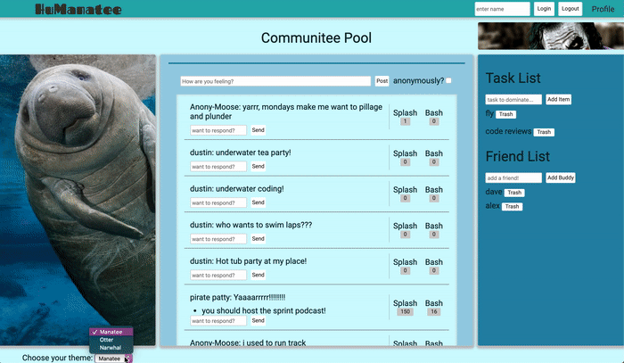

# Humanatee

## Social Media for aquatic animals

* [Backend GitHub](https://github.com/codeHustler91/Humanatee-backend)

Thanks for visiting!

## Features of the website

### Overview
* Login, post your thoughts, read other animal's posts, and splash(like) and/or bash(dislike) them as you please!

### Change Themes
* Personalize your web experience
* Choose between 3 different aquatic animal themes
    * Manatee, Otter, or Narwhal
       

### Post Anony-Moose-ly!
* If you feel like venting, but don't want judgment!
* Blame it on the Moose, he's always grumpy anyway

### Task List
* Don't want to forget something? Put it on the list!
       

#### Assets used:
   * Vanilla Javascript
